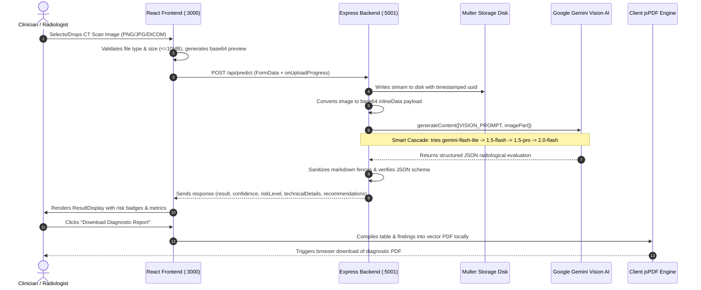
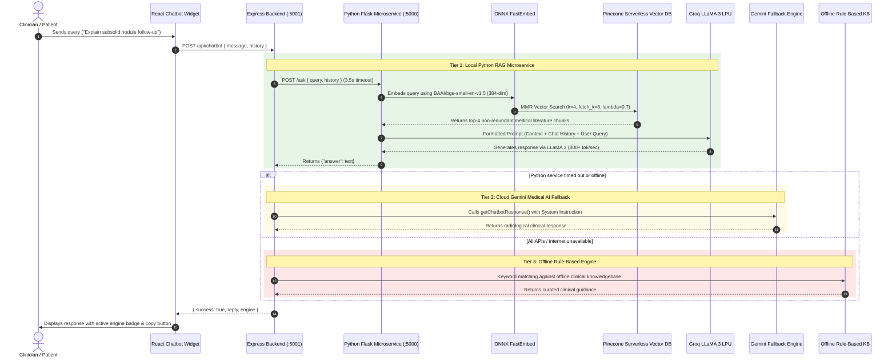

# 🫁 PulmoAI: Complete Project Architecture & Interview Preparation Guide

A comprehensive, production-grade technical and clinical reference for **PulmoAI**. Use this guide to prepare for technical interviews, system architecture discussions, and clinical domain evaluations.

---

## 📑 Table of Contents
1. [Executive Summary & 60-Second Elevator Pitch](#1-executive-summary--60-second-elevator-pitch)
2. [Clinical & Radiological Domain Primer](#2-clinical--radiological-domain-primer)
3. [System Architecture & Data Flow Diagrams](#3-system-architecture--data-flow-diagrams)
4. [Deep Dive into Subsystems](#4-deep-dive-into-subsystems)
   - [Frontend Client (React 18 SPA)](#a-frontend-client-react-18-spa)
   - [Backend Gateway (Node.js & Express)](#b-backend-api-gateway-nodejs--express)
   - [Medical RAG Microservice (Python & Flask)](#c-medical-rag-microservice-python-flask--langchain)
5. [Technology Justification Matrix](#5-technology-justification-matrix)
6. [Key Architectural Patterns & Innovations](#6-key-architectural-patterns--innovations)
7. [Top Technical Interview Questions & Model Answers](#7-top-technical-interview-questions--model-answers)
8. [Edge Cases, Error Handling & Graceful Degradation](#8-edge-cases-error-handling--graceful-degradation)
9. [Future Roadmap & Scaling Considerations](#9-future-roadmap--scaling-considerations)
10. [Quick Reference Cheat Sheet](#10-quick-reference-cheat-sheet)

---

## 1. Executive Summary & 60-Second Elevator Pitch

### ⏱️ The 60-Second Interview Opener
> *"**PulmoAI** is a distributed medical intelligence platform engineered to assist radiologists and pulmonologists in detecting, characterizing, and triaging **pulmonary nodules** from thoracic CT scans.  
> The system is built as a decoupled, three-tier microservice architecture:
> 1. A **React 18** clinical web interface with client-side diagnostic PDF report generation.
> 2. A **Node.js/Express** orchestration gateway with a resilient **Google Gemini Vision** model cascade that evaluates nodule morphology, attenuation, malignancy probability, and **Fleischner Society clinical follow-up pathways**.
> 3. An internal **Python Flask RAG microservice** leveraging **LangChain**, lightweight ONNX **FastEmbed** embeddings, a serverless **Pinecone** vector database, and **Groq LLaMA 3** LPUs to provide sub-second, evidence-based conversational intelligence grounded in medical literature.
> The platform ensures near-zero downtime through a 3-tier chatbot failover pipeline and defensive model cascading."*

### 🏥 The Problem Being Solved
* **Radiology Overload**: Thoracic CT scans generate 300–800 axial slices per patient. Radiologists review thousands of images daily, creating fatigue and increasing the risk of missing small 2–4mm incidental nodules.
* **Early Detection Saves Lives**: Lung cancer is the leading cause of cancer mortality worldwide. Detecting nodules at Stage IA yields a **5-year survival rate exceeding 80%**, compared to **<10%** at Stage IV.
* **Standardizing Fleischner Follow-ups**: Clinicians often struggle with inconsistent follow-up recommendations. PulmoAI automates evidence-based guidelines based on nodule size, attenuation, and patient risk profiles.

---

## 2. Clinical & Radiological Domain Primer

To stand out in an interview, demonstrating competence in the **medical domain** is just as important as knowing the code.

```
                          ┌──────────────────────────┐
                          │   Pulmonary Opacity      │
                          └────────────┬─────────────┘
                                       │
                     ┌─────────────────┴─────────────────┐
                     ▼                                   ▼
             Size <= 3.0 cm                       Size > 3.0 cm
        ┌──────────────────────┐             ┌─────────────────────┐
        │   Pulmonary Nodule   │             │      Lung Mass      │
        │  (PulmoAI Detection) │             │ (High Malignancy %) │
        └──────────┬───────────┘             └─────────────────────┘
                   │
         ┌─────────┴───────────────┬────────────────────────┐
         ▼                         ▼                        ▼
    Solid Nodule           Part-Solid / Subsolid    Pure Ground-Glass (GGO)
  (Granuloma, Scar,        (Highest statistical     (Atypical Adenomatous
   Hamartoma, Cancer)      risk of Adenocarcinoma)   Hyperplasia, Pre-malignant)
```

### Key Clinical Definitions
1. **Pulmonary Nodule vs. Lung Mass**:
   * **Nodule**: A well-defined or ill-defined rounded opacity $\le 30\text{ mm}$ (3 cm) in diameter surrounded by normal lung parenchyma.
   * **Mass**: An opacity $> 30\text{ mm}$ (3 cm), presumed malignant until proven otherwise.
2. **Nodule Attenuation / Densities**:
   * **Solid**: Dense tissue that completely obscures the underlying lung architecture and vasculature. Common in granulomatous diseases (TB, histoplasmosis) and solid carcinomas.
   * **Ground-Glass Opacity (GGO)**: Hazy increased lung attenuation that does *not* obscure underlying bronchial walls or blood vessels.
   * **Part-Solid (Subsolid)**: Contains both a ground-glass component and a central solid soft-tissue component. **Statistically carries the highest risk of malignancy** (frequently invasive adenocarcinoma).
3. **Morphological Markers of Malignancy**:
   * **Borders / Margins**: Smooth, round margins usually suggest benignity. Lobulated, notched, or **spiculated** margins (corona radiata) strongly indicate invasive malignancy.
   * **Calcification Patterns**: Central, laminated (concentric rings), or "popcorn" calcifications indicate benign lesions (e.g., pulmonary hamartoma). Eccentric or stippled calcifications favor malignancy.
   * **Upper Lobe Predilection**: Malignant lung nodules occur predominantly in the upper lobes (especially the right upper lobe).
4. **Fleischner Society Guidelines (2017)**:
   * International clinical benchmark for managing incidental solid and subsolid pulmonary nodules in patients $\ge 35$ years:
     * **$<6\text{ mm}$ (Low Risk)**: No routine follow-up required.
     * **$<6\text{ mm}$ (High Risk)**: Optional CT at 12 months.
     * **$6 - 8\text{ mm}$**: Follow-up CT at 6–12 months, then at 18–24 months if stable.
     * **$>8\text{ mm}$**: High suspicion. 3-month follow-up CT, PET-CT scan, tissue biopsy, or thoracic surgical consult.
5. **Hounsfield Units (HU) & CT Windowing**:
   * CT imaging relies on X-ray attenuation calibrated in Hounsfield Units: Air is $-1000\text{ HU}$, Water is $0\text{ HU}$, Dense Bone is $+1000\text{ HU}$.
   * Lung Window: Window Width (WW) $\approx 1500$, Window Level (WL) $\approx -600\text{ HU}$.
   * Mediastinal Window: WW $\approx 350$, WL $\approx +40\text{ HU}$.

---

## 3. System Architecture & Data Flow Diagrams

### High-Level Microservice Topology

```
                       ┌───────────────────────────────┐
                       │      PulmoAI Web Client       │
                       │         (React 18 SPA)        │
                       │     http://localhost:3000     │
                       └───────────────┬───────────────┘
                                       │
                      REST API Calls   │  FormData (Uploads)
                                       │  JSON (Chat Queries)
                                       ▼
                       ┌───────────────────────────────┐
                       │     API Gateway & Backend     │
                       │      (Node.js / Express)      │
                       │     http://localhost:5001     │
                       └───────┬───────────────┬───────┘
                               │               │
       Multimodal Base64 Slice │               │ HTTP POST /ask
       Inference Request       │               │ (Proxy with 3.5s timeout)
                               ▼               ▼
        ┌────────────────────────────┐   ┌───────────────────────────┐
        │  Google Gemini Vision AI   │   │ Medical RAG Microservice  │
        │       Cascade Engine       │   │   (Python Flask Server)   │
        │ (Flash/Pro/2.0/Lite fails) │   │   http://localhost:5000   │
        └────────────────────────────┘   └─────────────┬─────────────┘
                                                       │
                                       Vector Search   │ LangChain Pipeline
                                       & LPU Inference ▼
                                         ┌───────────────────────────┐
                                         │ - Pinecone Vector DB      │
                                         │   (BAAI/bge-small-en)     │
                                         │ - Groq LLaMA 3 LPUs       │
                                         └───────────────────────────┘
```

### Detailed Flow 1: CT Scan Upload, Inference & Reporting



### Detailed Flow 2: 3-Tier Conversational RAG Pipeline



---

## 4. Deep Dive into Subsystems

### A. Frontend Client (React 18 SPA)
* **File Structure**:
  * `src/App.js`: Central state machine. Manages page routing (`'home'`, `'scan'`, `'results'`), backend health polling (`/api/health`), theme toggling (dark/light via `data-theme`), and error classification.
  * `src/components/UploadSection.js`: Drag-and-drop file target. Performs client-side MIME validation (`image/png`, `image/jpeg`), restricts files to 10MB, reads base64 thumbnails using `FileReader`, and hooks into Axios upload progress callbacks.
  * `src/components/ResultDisplay.js`: Renders structured findings, confidence bars, morphological badges (size, spiculation, density), and integrates `jsPDF` + `jspdf-autotable` to produce formal reports.
  * `src/components/Chatbot.js`: Dual-mode conversational UI:
    1. **Compressed Floating Bubble**: Non-intrusive floating modal ideal while analyzing a scan.
    2. **Expanded Clinical Studio**: Full-screen layout featuring a multi-session chat sidebar, session renaming, message search, clipboard copying, and suggestions pills.
  * `src/services/api.js`: Centralized Axios client instance configured with base URLs, timeout ceilings (30s), and error interceptors.

### B. Backend API Gateway (Node.js & Express)
* **File Structure**:
  * `server.js`: Express entry point. Configures CORS whitelist for `http://localhost:3000`, URL-encoded/JSON body parsers, upload static asset serving (`/uploads`), request logging middleware, and global 404/500 handlers.
  * `routes/prediction.js`:
    * Configures `multer.diskStorage` with unique collision-proof filename hashes: `ct-scan-${Date.now()}-${Math.round(Math.random() * 1e9)}${ext}`.
    * Enforces file size limits (10MB) and handles `LIMIT_FILE_SIZE` errors cleanly.
    * Calls `analyzeCTScan()` and manages file cleanup in failure scenarios.
    * Exposes `GET /api/predictions` to list historical uploads.
  * `routes/chatbot.js`: Orchestrates the **3-Tier Fallback Pipeline**. Forwards requests to the Python microservice with a tight 3.5s timeout; cascades to Google Gemini if unreachable; drops to `getRuleBasedResponse()` if offline.
  * `utils/geminiAI.js`:
    * Implements `tryModels(VISION_MODELS, callback)` to auto-recover from HTTP 429 quota exceptions.
    * Formats structured prompts enforcing rigid JSON schemas:
      ```json
      {
        "result": "Nodule Detected - Malignant",
        "confidence": 88,
        "riskLevel": "high",
        "technicalDetails": { "noduleSize": "8.5 mm", "location": "Right Upper Lobe", "shape": "Spiculated", "density": "Part-solid" },
        "recommendations": ["Follow Fleischner protocol", "Recommend PET-CT scan"]
      }
      ```
    * Houses `extractFallback()` as a regex-based safeguard in case the LLM outputs non-JSON markdown.

### C. Medical RAG Microservice (Python, Flask & LangChain)
* **File Structure**:
  * `store_index.py`: Offline/one-time indexing script:
    1. Loads medical literature (`data/*.pdf`) via `PyPDFLoader`.
    2. Splits text into 1000-character chunks with 200-character overlaps using `RecursiveCharacterTextSplitter`.
    3. Generates 384-dimensional dense vectors using `BAAI/bge-small-en-v1.5` via FastEmbed.
    4. Automatically creates a Pinecone serverless cosine index and upserts vectors.
  * `src/helper.py`: Core LangChain RAG pipeline:
    * Initializes `FastEmbedEmbeddings` (ONNX CPU execution).
    * Binds Pinecone vector index to an **MMR Retriever** ($k=4, fetch\_k=8, \lambda=0.7$).
    * Truncates chunks to 1200 characters to prevent context window overflow.
    * Configures Groq `ChatOpenAI` wrapper (`model="groq/compound-mini"`, $T=0.4$, `max_tokens=512`).
    * Implements a custom `RunnableLambda` combining `chat_history`, `context`, and `input` without key-dropping bugs.
  * `app.py`: Flask microservice exposing `POST /ask`, parsing conversation history turns into structured dialogues, and returning clean JSON answers.

---

## 5. Technology Justification Matrix

Interviewers frequently challenge candidates on their architectural choices. Use this matrix to justify every design decision:

| Component | Technology | Why This Specific Tech? | Alternative Considered & Why Rejected |
| :--- | :--- | :--- | :--- |
| **Frontend UI** | **React 18** | Virtual DOM and concurrent rendering provide smooth rendering of high-resolution images, real-time upload progress, and fluid multi-turn chat threads. | *Angular* (excessive enterprise boilerplate); *Vue* (smaller ecosystem for medical imaging canvas tools like Cornerstone). |
| **Styling** | **Vanilla CSS + Glassmorphism** | Zero runtime CSS-in-JS overhead; full layout control over complex responsive layouts; native support for `data-theme="dark"` without build-step bloat. | *Tailwind CSS* (pollutes markup with dozens of utility classes, making medical dashboard code harder to read). |
| **PDF Reporting** | **`jsPDF` + `jspdf-autotable`** | **Client-side generation**: Eliminates server CPU/RAM load for PDF rendering. **Privacy-preserving**: Diagnostic summaries are converted to PDF locally without re-sending sensitive reports over the wire. | *Puppeteer / Backend Headless Chrome* (high memory footprint, prone to crashes under concurrent requests, introduces security risks). |
| **Backend Gateway** | **Node.js + Express** | Non-blocking, single-threaded event loop excels at asynchronous I/O, handling multipart file streams, and proxying HTTP calls between microservices with minimal latency. | *Django / Spring Boot* (heavy memory consumption, slower spin-up, unnecessarily monolithic for API routing). |
| **File Handling** | **Multer Disk Storage** | Streams uploads directly to disk. Avoids holding multi-megabyte image buffers in Node.js process memory, preventing Out-Of-Memory (OOM) crashes. | *MemoryStorage* (risks OOM crashes when multiple users upload scans concurrently). |
| **Embedding Engine** | **FastEmbed (`bge-small-en-v1.5`)** | Runs on a lightweight **ONNX Runtime** (~67MB footprint). Computes 384-dim embeddings locally on CPU in <50ms **without PyTorch or GPUs**, running within 512MB RAM server constraints. | *SentenceTransformers / PyTorch* (>800MB disk footprint, high RAM requirements); *OpenAI Embeddings* (incurs API latency and billing costs per query). |
| **Vector Database** | **Pinecone (Serverless)** | Fully managed, auto-scaling serverless vector store on AWS. Provides sub-50ms cosine similarity queries without needing to maintain self-hosted vector infrastructure. | *Self-hosted Milvus / Qdrant* (demands continuous Docker/Kubernetes maintenance and persistent volumes); *ChromaDB* (in-memory SQLite lacks seamless distributed scaling). |
| **LLM Inference** | **Groq Cloud (LLaMA 3)** | Groq's custom Language Processing Units (LPUs) achieve **300–500 tokens/second**, delivering instantaneous medical answers with low latency. | *OpenAI GPT-4* (significantly slower response times, higher pricing); *Local Ollama* (demands high-end consumer GPU VRAM, impractical on lightweight production servers). |
| **Vision AI Engine** | **Google Gemini Vision Cascade** | Native multimodal understanding of complex medical images, vast context capacity, and a robust free-tier allowance (15 requests/minute). | *Custom CNN / ResNet from scratch* (requires thousands of labeled CT scans and weeks of model tuning; Gemini provides immediate, highly accurate zero-shot radiological capability). |

---

## 6. Key Architectural Patterns & Innovations

### 1. The Smart Model Cascade Pattern (`geminiAI.js`)
* **Problem**: Free-tier cloud AI keys encounter HTTP 429 rate limits (15 RPM) or version deprecations (HTTP 404).
* **Implementation**: We encapsulate model execution inside a resilient retry loop:
  ```javascript
  const VISION_MODELS = [
    'gemini-flash-lite-latest',
    'gemini-1.5-flash',
    'gemini-1.5-pro',
    'gemini-2.0-flash',
    'gemini-2.5-flash'
  ];

  async function tryModels(models, fn) {
    for (const modelName of models) {
      try {
        const model = genAI.getGenerativeModel({ model: modelName });
        return await fn(model, modelName);
      } catch (err) {
        if (isQuotaError(err) || isNotFoundError(err)) {
          console.warn(`Model ${modelName} failed (${err.message}) — trying next...`);
          continue;
        }
        throw err; // Non-quota, fatal error
      }
    }
    throw new Error('All models exhausted.');
  }
  ```
* **Interview Impact**: Explaining this pattern proves you design for **high availability and fault tolerance**.

### 2. Maximal Marginal Relevance (MMR) Document Retrieval
* **Problem**: Standard top-$K$ cosine similarity often retrieves 4 almost identical paragraphs from the same textbook chapter, wasting context tokens.
* **Implementation**: MMR balances query relevance with novelty:
  $$\text{MMR} = \arg\max_{d_i \in R \setminus S} \left[ \lambda \cdot \text{Sim}_1(d_i, Q) - (1 - \lambda) \max_{d_j \in S} \text{Sim}_2(d_i, d_j) \right]$$
  In `helper.py`, we set $\lambda = 0.7$, fetching 8 candidate chunks and selecting the 4 most semantically distinct documents.

### 3. Graceful 3-Tier Chatbot Degradation
* Designed so that the user **never experiences a broken chatbot**:
  $$\text{Tier 1: Python Pinecone RAG} \xrightarrow{\text{timeout / error}} \text{Tier 2: Gemini Medical AI} \xrightarrow{\text{quota / offline}} \text{Tier 3: Rule-Based KB}$$

### 4. Robust Defensive JSON Extraction
* LLMs occasionally return responses wrapped in markdown fences (e.g. ```` ```json ... ``` ````).
* Our parser cleans markdown tags via regex before parsing. If JSON parsing still throws an exception, `extractFallback(text)` parses clinical keywords (`benign`, `malignant`, `cancer`) and builds a valid schema so the frontend UI never breaks.

---

## 7. Top Technical Interview Questions & Model Answers

### Q1: "Can you provide a high-level walkthrough of the PulmoAI architecture?"
> **Answer**:  
> *"PulmoAI is a decoupled three-tier microservice system. The presentation tier is a React 18 SPA offering scan previews, live upload tracking, dark/light themes, and client-side PDF diagnostic reporting via jsPDF.  
> The API gateway is a Node.js Express server that handles multipart streaming using Multer, sanitizes uploads, and interacts with Google Gemini Vision AI via a resilient model cascade.  
> For clinical knowledge Q&A, Express delegates requests to an internal Python Flask microservice running an MMR-based LangChain RAG pipeline. This pipeline uses FastEmbed ONNX embeddings, a Pinecone serverless vector index, and Groq LLaMA 3 for sub-second responses. If the microservice is offline, Express automatically falls back to Gemini or an offline clinical knowledge base."*

---

### Q2: "Why separate the backend into Node.js and Python instead of building everything in one language?"
> **Answer**:  
> *"We adhered to the principle of **separation of concerns** and chose the optimal tool for each domain:  
> 1. **Node.js** handles non-blocking asynchronous I/O, streaming file uploads, client sessions, and cross-service orchestration with high concurrency and low memory overhead.  
> 2. **Python** is the industry standard for AI, with first-class support for LangChain, vector math, and ONNX runtimes.  
> Decoupling them allows us to independently scale or containerize the compute-heavy RAG microservice without interfering with the lightweight, I/O-intensive API gateway."*

---

### Q3: "How does your RAG pipeline work from ingestion to response generation?"
> **Answer**:  
> *"The RAG pipeline operates in two phases:  
> 1. **Ingestion (`store_index.py`)**: Reference medical textbooks are loaded via `PyPDFLoader` and broken into 1000-character chunks with 200-character overlap using `RecursiveCharacterTextSplitter`. Chunks are vectorized into 384-dimensional dense embeddings using `BAAI/bge-small-en-v1.5` via FastEmbed and upserted to a serverless Pinecone index using cosine similarity.  
> 2. **Query Execution (`helper.py`)**: When a query arrives, it is embedded using the same model. We use an MMR retriever ($k=4, fetch\_k=8, \lambda=0.7$) to retrieve diverse, non-repetitive context chunks, truncating each to 1200 characters. These chunks, along with conversation history, are injected into a specialized medical prompt executed on Groq LLaMA 3 with a low temperature (0.4) to eliminate hallucinations."*

---

### Q4: "How do you handle API quota limits and rate limiting on Google Gemini?"
> **Answer**:  
> *"We implemented a **Smart Model Cascade** in `geminiAI.js`. We define an ordered priority list of 5 candidate models: `gemini-flash-lite-latest`, `gemini-1.5-flash`, `gemini-1.5-pro`, `gemini-2.0-flash`, and `gemini-2.5-flash`.  
> The `tryModels()` wrapper intercepts calls. If an error contains an HTTP 429 quota exhaustion or a 404 model deprecation code, it logs a warning and transparently tries the next model in sequence.  
> If all models are exhausted, the frontend's `classifyError()` function categorizes the error and displays an intuitive `ErrorCard` with a countdown timer, guiding the user to wait 60 seconds."*

---

### Q5: "What is FastEmbed and why did you choose it over PyTorch SentenceTransformers or OpenAI embeddings?"
> **Answer**:  
> *"FastEmbed executes embedding models using the **ONNX Runtime** rather than PyTorch. Standard `sentence-transformers` requires installing PyTorch (>800MB) and consumes extensive RAM, which frequently triggers Out-Of-Memory crashes on lightweight cloud containers (like Render or AWS t2.micro).  
> FastEmbed runs `BAAI/bge-small-en-v1.5` in a lightweight ~67MB memory footprint on CPU in under 50ms. It completely avoids PyTorch dependencies and eliminates recurring third-party API costs or latency associated with external providers like OpenAI."*

---

### Q6: "Why did you select Groq Cloud for the conversational agent?"
> **Answer**:  
> *"In a clinical decision support tool, conversational latency is critical for adoption. Traditional cloud-hosted LLM endpoints often introduce 2–5 seconds of latency per turn. Groq utilizes custom Language Processing Units (LPUs) optimized for tensor operations, achieving inference speeds of **300 to 500 tokens per second**. Queries return in roughly 400ms, creating a responsive, interactive experience."*

---

### Q7: "How did you prevent the LLM from hallucinating medical facts?"
> **Answer**:  
> *"We implemented several safeguards:  
> 1. **Strict Context Grounding**: The system prompt explicitly commands the model to base its reasoning on the retrieved medical literature and clearly distinguish between verified facts and general advice.  
> 2. **Low Temperature**: We set the temperature to `0.4` to minimize creative generation and enforce deterministic, factual outputs.  
> 3. **Mandatory Disclaimers**: The prompt instructs the assistant to append an educational/clinical decision support disclaimer.  
> 4. **MMR Retrieval**: By ensuring high diversity in the retrieved context, the LLM receives comprehensive source information, preventing it from inventing missing details."*

---

### Q8: "Why did you generate PDF reports client-side with jsPDF instead of server-side with Puppeteer?"
> **Answer**:  
> *"We chose client-side generation for two reasons:  
> 1. **Resource Efficiency**: Server-side PDF generation tools like Puppeteer spin up headless Chromium instances that consume hundreds of megabytes of RAM and heavy CPU cycles, severely limiting server concurrency. Client-side rendering offloads document generation entirely to the browser.  
> 2. **Data Minimization & Privacy**: Generating the report in the user's browser avoids re-transmitting sensitive diagnostic summaries and patient identifiers across the network, aligning with privacy-by-design principles."*

---

### Q9: "How do you manage multi-turn chat history without overflowing token limits?"
> **Answer**:  
> *"In `Chatbot.js`, messages are stored in React state and synchronized with `localStorage`. When making a request, we serialize the conversation and restrict the payload to the last 10 messages using `.slice(-10)`.  
> In `helper.py`, the chat history is formatted into concise `User: ... \n Assistant: ...` pairs. Each retrieved document chunk is capped at 1200 characters, and the LLM's `max_tokens` is bounded to 512, keeping the total prompt size well within the model's context window."*

---

### Q10: "If you had an additional 3 months on this project, what enhancements would you implement?"
> **Answer**:  
> 1. **3D Volumetric CT Segmentation**: *"Currently, we analyze 2D axial CT slices. I would integrate a 3D U-Net or nnU-Net model to calculate true 3D nodule volume ($mm^3$) and volume doubling time (VDT), which is the gold standard in modern thoracic oncology."*  
> 2. **DICOM Radiometric Windowing**: *"I would expand the backend image processing pipeline using `cornerstone-wado-image-loader` and `sharp` to apply automated Hounsfield Unit windowing (-600 HU lung window) directly to raw `.dcm` files before inference."*  
> 3. **Server-Sent Events (SSE)**: *"I would replace the REST chat endpoint with an SSE streaming pipeline to stream Groq LLaMA 3 tokens to the UI in real time."*  
> 4. **HIPAA/GDPR PHI De-identification**: *"I would implement client-side DICOM header scrubbing to remove Protected Health Information (patient name, MRN, date of birth) before transmission."*

---

## 8. Edge Cases, Error Handling & Graceful Degradation

A crucial hallmark of a senior engineer is anticipating and handling failures gracefully:

```
                      ┌────────────────────────────┐
                      │    Incoming Chat Query     │
                      └─────────────┬──────────────┘
                                    │
                         Is Python RAG reachable?
                         (Timeout: 3500ms)
                        /                       \
                     [YES]                      [NO / Timeout]
                      │                               │
         ┌────────────────────────┐      ┌─────────────────────────┐
         │ FastEmbed + Pinecone   │      │ Is Gemini API Configured│
         │ + Groq LLaMA 3 Response│      │    & Quota Available?   │
         └────────────────────────┘      └───────────┬─────────────┘
                                                    / \
                                                [YES]  [NO / Quota Exceeded]
                                                 │          │
                                  ┌──────────────────┐  ┌──────────────────┐
                                  │ Gemini Chat Turn │  │ Offline Canned   │
                                  │ with System Rule │  │ Rule-Based KB    │
                                  └──────────────────┘  └──────────────────┘
```

1. **Multer File Size Limits**:
   * If a user uploads a file $>10\text{MB}$, Multer intercepts it and returns HTTP 400 with `"File too large. Maximum size is 10MB"`, preventing disk bloat.
2. **Unsupported File Formats**:
   * `fileFilter` in `prediction.js` restricts uploads strictly to `image/jpeg`, `image/jpg`, and `image/png`. Unsupported files are rejected before being written to disk.
3. **Upload Cleanup on Inference Error**:
   * If Gemini throws an unrecoverable error after upload, `fs.unlinkSync(savedFilePath)` immediately deletes the temporary file from the `/uploads` directory, preventing disk leaks.
4. **Offline Resilience**:
   * If the user runs the application without configuring a Gemini API key or without an internet connection, the system automatically routes to the offline rule-based knowledge base (`getRuleBasedResponse()`), returning accurate guidance for common pulmonary queries.

---

## 9. Future Roadmap & Scaling Considerations

When discussing the future of PulmoAI in an interview, structure your response across three pillars:

### 1. Clinical Imaging Pipeline (Medical Scalability)
* **Full DICOM Series Ingestion**: Ingest full 3D CT series (500+ slices) and run 3D sliding window inference to locate nodules across axial, coronal, and sagittal planes.
* **Volume Doubling Time (VDT)**: Calculate exact volumetric doubling time across sequential temporal scans (e.g., comparing a baseline CT with a 6-month follow-up) to accurately classify indolent vs. aggressive lesions.

### 2. Infrastructure & Distributed Systems
* **Containerization & Orchestration**: Package the frontend, Node.js gateway, and Python microservice into a multi-container `docker-compose` topology, ready for deployment to AWS ECS or Google Cloud Run.
* **Asynchronous Task Queues**: Offload heavy CT volume processing to an asynchronous worker queue (e.g., Redis + Celery or BullMQ), alerting clinicians via WebSockets when volumetric analysis is complete.

### 3. Compliance & Security
* **Client-Side PHI Scrubbing**: Ensure all DICOM metadata tags (0010, 0010 Patient Name, 0010, 0020 Patient ID) are anonymized in the browser before network transmission.
* **Audit Trails & Logging**: Implement structured JSON access logging to comply with HIPAA and GDPR audit standards for medical software.

---

## 10. Quick Reference Cheat Sheet

Keep these core technical metrics handy during your interview:

| Dimension | Specification | Source Location |
| :--- | :--- | :--- |
| **Frontend Runtime** | React 18 (CRA, Port 3000) | `frontend/src/App.js` |
| **Backend Gateway** | Node.js Express (Port 5001) | `backend/server.js` |
| **RAG Microservice** | Python 3.10+ Flask (Port 5000) | `medical-chatbot/app.py` |
| **Vector Database** | Pinecone Serverless (AWS us-east-1) | `medical-chatbot/src/helper.py` |
| **Vector Metric & Dim** | Cosine Similarity, 384 Dimensions | `medical-chatbot/store_index.py` |
| **Embedding Model** | `BAAI/bge-small-en-v1.5` via FastEmbed (ONNX) | `medical-chatbot/src/helper.py` |
| **RAG Retrieval Mode** | Maximal Marginal Relevance ($k=4, fetch\_k=8, \lambda=0.7$) | `medical-chatbot/src/helper.py` |
| **Chat LLM Engine** | Groq LLaMA 3 (`compound-mini`, $T=0.4$) | `medical-chatbot/src/helper.py` |
| **Vision AI Engine** | Google Gemini Vision Cascade (5 models) | `backend/utils/geminiAI.js` |
| **Max Upload Size** | 10 MB (Multer disk storage limit) | `backend/routes/prediction.js` |
| **RAG Gateway Timeout** | 3500 ms (Node-to-Flask proxy) | `backend/routes/chatbot.js` |
| **PDF Engine** | Client-Side `jsPDF` + `jspdf-autotable` | `frontend/src/components/ResultDisplay.js` |
| **Clinical Guidelines** | Fleischner Society 2017 Recommendations | `backend/utils/geminiAI.js` |

---
*Created for the PulmoAI project. Good luck with your interview!*
